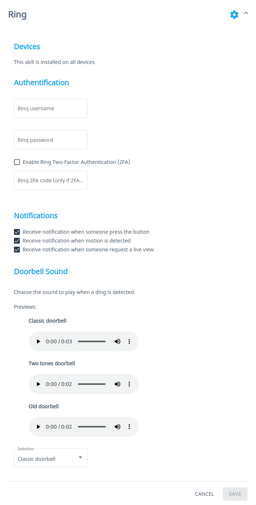

[](https://travis-ci.com/github/smartgic/mycroft-ring-skill) [](https://opensource.org/licenses/MIT) [](https://github.com/smartgic/mycroft-ring-skill/pulls) [](https://mycroft.ai) [](https://discord.gg/Vu7Wmd9j)


<p align="center">
  
</p>

# Ring

Retrieve alerts from Ring devices such as the Doorbell, Chime, Camera.

## About

[Ring](https://www.ring.com) is the company behind the smart doorbell that contains a high-definition camera, a motion sensor, and a microphone and speaker for two-way audio communication.

This skill allows Mycroft to notify you if someone at your front door.

## Examples

* "discover my ring devices"


## Installation

Make sure to be within the Mycroft `virtualenv` before running the `msm` command.

```
$ . mycroft-core/venv-activate.sh
$ msm install https://github.com/smartgic/mycroft-ring-skill.git
```

## Configuration

This skill utilizes the `settings.json` file which allows you to configure this skill via `home.mycroft.ai` after a few seconds of having the skill installed you should see something like below in the https://home.mycroft.ai/#/skill location:



Fill this out with your appropriate information and hit the `save` button.


## Credits

- [Smart'Gic](https://smartgic.io/)
- [python_ring_doorbell](https://github.com/tchellomello/python-ring-doorbell)
- [SoundBible](https://soundbible.com/)

## Category

**IoT & Home**

## Tags

#camera
#iot
#doorbell
#ring
#device
#smart